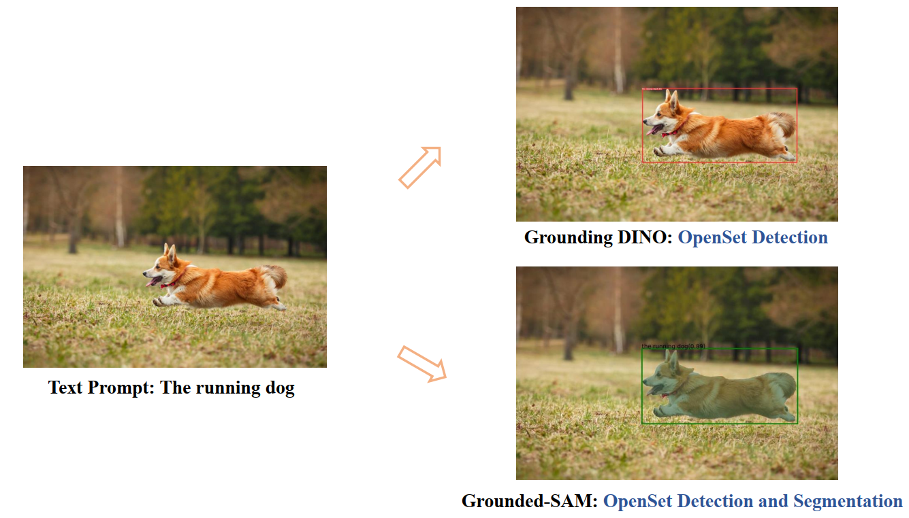
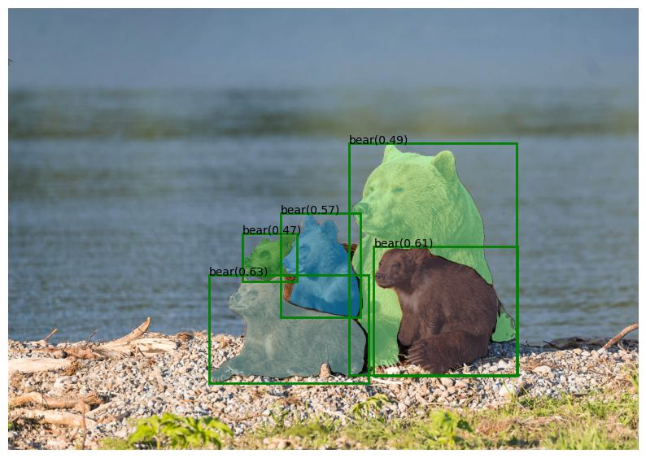
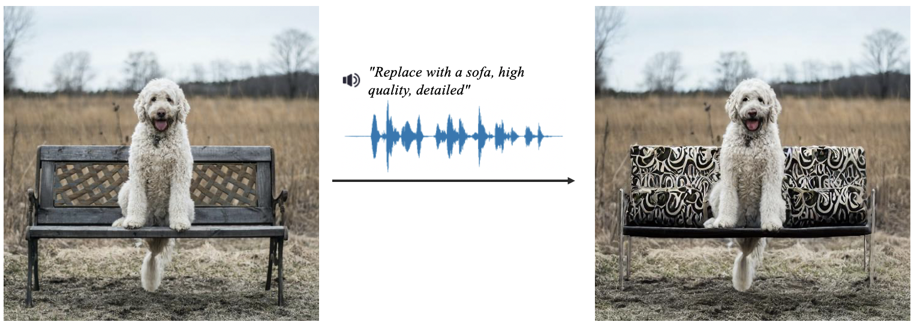

# Grounded-Segment-Anything

Run this repo in a Free GPU powered Gradient Notebook

[](https://console.paperspace.com/github/gradient-ai/Grounded-Segment-Anything/?machine=Free-GPU)

[](https://www.youtube.com/watch?v=GuEDDBWrN24&t=521s) [](https://github.com/camenduru/grounded-segment-anything-colab) [](https://huggingface.co/spaces/IDEA-Research/Grounded-SAM) [](https://modelscope.cn/studios/tuofeilunhifi/Grounded-Segment-Anything/summary) [](https://huggingface.co/spaces/yizhangliu/Grounded-Segment-Anything) [](https://github.com/continue-revolution/sd-webui-segment-anything) [](./grounded_sam.ipynb)

We plan to create a very interesting demo by combining [Grounding DINO](https://github.com/IDEA-Research/GroundingDINO) and [Segment Anything](https://github.com/facebookresearch/segment-anything) which aims to detect and segment Anything with text inputs! And we will continue to improve it and create more interesting demos based on this foundation.

We are very willing to **help everyone share and promote new projects** based on Segment-Anything, Please checkout here for more amazing demos and works in the community: [Highlight Extension Projects](#bulb-highlight-extension-projects). You can submit a new issue (with `project` tag) or a new pull request to add new project's links.

**🍄 Why Building this Project?**

The **core idea** behind this project is to **combine the strengths of different models in order to build a very powerful pipeline for solving complex problems**. And it's worth mentioning that this is a workflow for combining strong expert models, where **all parts can be used separately or in combination, and can be replaced with any similar but different models (like replacing Grounding DINO with GLIP or other detectors / replacing Stable-Diffusion with ControlNet or GLIGEN/ Combining with ChatGPT)**.

**🍊 Preliminary Works**

- [Segment Anything](https://github.com/facebookresearch/segment-anything) is a strong segmentation model. But it needs prompts (like boxes/points) to generate masks.
- [Grounding DINO](https://github.com/IDEA-Research/GroundingDINO) is a strong zero-shot detector which is capable of to generate high quality boxes and labels with free-form text.
- [OSX](https://osx-ubody.github.io/) is a strong and efficient one-stage motion capture method to generate high quality 3D human mesh from monucular image. We also release a large-scale upper-body dataset UBody for a more accurate reconstrution in the upper-body scene.
- [Stable-Diffusion](https://github.com/CompVis/stable-diffusion) is an amazing strong text-to-image diffusion model.
- [BLIP](https://github.com/salesforce/lavis) is a wonderful language-vision model for image understanding.
- [Visual ChatGPT](https://github.com/microsoft/visual-chatgpt) is a wonderful tool that connects ChatGPT and a series of Visual Foundation Models to enable sending and receiving images during chatting.
- [VoxelNeXt](https://github.com/dvlab-research/VoxelNeXt) is a clean, simple, and fully-sparse 3D object detector, which predicts objects directly upon sparse voxel features.

**🔥 Highlighted Projects**

- Checkout the [Segment Everything Everywhere All at Once](https://github.com/UX-Decoder/Segment-Everything-Everywhere-All-At-Once) demo! It supports segmenting with various types of prompts (text, point, scribble, referring image, etc.) and any combination of prompts.
- Checkout the [OpenSeeD](https://github.com/IDEA-Research/OpenSeeD) for the interactive segmentation with box input to generate mask.
- Visual instruction tuning with GPT-4! Please check out the multimodal model **LLaVA**: [[Project Page](https://llava-vl.github.io/)] [[Paper](https://arxiv.org/abs/2304.08485)] [[Demo](https://llava.hliu.cc/)] [[Data](https://huggingface.co/datasets/liuhaotian/LLaVA-Instruct-150K)] [[Model](https://huggingface.co/liuhaotian/LLaVA-13b-delta-v0)]

**🍉 The Supported Amazing Demos in this Project**

- [GroundingDINO: Detect Everything with Text Prompt](#runner-run-grounding-dino-demo)
- [GroundingDINO + Segment-Anything: Detect and Segment Everything with Text Prompt](#runningman-run-grounded-segment-anything-demo)
- [GroundingDINO + Segment-Anything + Stable-Diffusion: Detect, Segment and Generate Anything with Text Prompts](#skier-run-grounded-segment-anything--inpainting-demo)
- [Grounded-SAM + Stable-Diffusion Gradio APP](#golfing-run-grounded-segment-anything--inpainting-gradio-app)
- [Grounded-SAM + BLIP: Automatically Labeling System!](#robot-run-grounded-segment-anything--blip-demo)
- [Whisper + Grounded-SAM: Detect and Segment Everything with Speech!](#openmouth-run-grounded-segment-anything--whisper-demo)
- [Grounded-SAM + Visual ChatGPT: Automatically Label & Generate Everything with ChatBot!](#speechballoon-run-chatbot-demo)
- [Grounded-SAM + OSX: Text to 3D Whole-Body Mesh Recovery, Detect Anyone and Reconstruct his 3D Humen Mesh!](#mandancing-run-grounded-segment-anything--osx-demo)
- [Interactive Fashion-Edit Playground: Click for Segmentation And Editing!](https://github.com/IDEA-Research/Grounded-Segment-Anything/tree/humanFace)
- [Interactive Human-face Editing Playground: Click And Editing Human Face!](https://github.com/IDEA-Research/Grounded-Segment-Anything/tree/humanFace)

## The Amazing Demo Preview (Continual Updating)

**🔥 ChatBot for our project is built**

https://user-images.githubusercontent.com/24236723/231955561-2ae4ec1a-c75f-4cc5-9b7b-517aa1432123.mp4

**🔥 🔈Speak to edit🎨: Whisper + ChatGPT + Grounded-SAM + SD**


**🔥 Grounded-SAM: Semi-automatic Labeling System**


**Tips**

- If you want to detect multiple objects in one sentence with [Grounding DINO](https://github.com/IDEA-Research/GroundingDINO), we suggest seperating each name with `.` . An example: `cat . dog . chair .`

**🔥 Grounded-SAM + Stable-Diffusion Inpainting: Data-Factory, Generating New Data**


**🔥 BLIP + Grounded-SAM: Automatic Label System**

Using BLIP to generate caption, extracting tags with ChatGPT, and using Grounded-SAM for box and mask generating. Here's the demo output:


**🔥 Grounded-SAM+OSX: Promptable 3D Whole-Body Human Mesh Recovery**

Using Grounded-SAM for box and mask generating, using [OSX](https://github.com/IDEA-Research/OSX) to estimate the SMPLX parameters and reconstruct 3D whole-body (body, face and hand) human mesh. Here's a demo:

<p align="middle">

<br>
</p>

**🔥 Interactive Editing**

- Release the interactive fashion-edit playground in [here](https://github.com/IDEA-Research/Grounded-Segment-Anything/tree/humanFace). Run in the notebook, just click for annotating points for further segmentation. Enjoy it!

  

- Release human-face-edit branch [here](https://github.com/IDEA-Research/Grounded-Segment-Anything/tree/humanFace). We'll keep updating this branch with more interesting features. Here are some examples:

  

**🔥 3D-Box via Segment Anything**
We extend the scope to 3D world by combining Segment Anything and [VoxelNeXt](https://github.com/dvlab-research/VoxelNeXt). When we provide a prompt (e.g., a point / box), the result is not only 2D segmentation mask, but also 3D boxes.


## :bulb: Highlight Extension Projects

- [Segment Everything Everywhere All at Once](https://github.com/UX-Decoder/Segment-Everything-Everywhere-All-At-Once) Support various types of prompts and any combination of prompts.
- [Computer Vision in the Wild (CVinW) Readings](https://github.com/Computer-Vision-in-the-Wild/CVinW_Readings) for those who are interested in open-set tasks in computer vision.
- Visual instruction tuning with GPT-4! Please check out the multimodal model **LLaVA**: [[Project Page](https://llava-vl.github.io/)] [[Paper](https://arxiv.org/abs/2304.08485)] [[Demo](https://llava.hliu.cc/)] [[Data](https://huggingface.co/datasets/liuhaotian/LLaVA-Instruct-150K)] [[Model](https://huggingface.co/liuhaotian/LLaVA-13b-delta-v0)]
- [OpenSeeD](https://github.com/IDEA-Research/OpenSeeD): interactive segmentation with box input to generate mask.
- [Zero-Shot Anomaly Detection](https://github.com/caoyunkang/GroundedSAM-zero-shot-anomaly-detection) by Yunkang Cao
- [EditAnything: ControlNet + StableDiffusion based on the SAM segmentation mask](https://github.com/sail-sg/EditAnything) by Shanghua Gao and Pan Zhou
- [IEA: Image Editing Anything](https://github.com/feizc/IEA) by Zhengcong Fei
- [SAM-MMRorate: Combining Rotated Object Detector and SAM](https://github.com/Li-Qingyun/sam-mmrotate) by Qingyun Li and Xue Yang
- [Awesome-Anything](https://github.com/VainF/Awesome-Anything) by Gongfan Fang
- [Prompt-Segment-Anything](https://github.com/RockeyCoss/Prompt-Segment-Anything) by Rockey
- [WebUI for Segment-Anything and Grounded-SAM](https://github.com/continue-revolution/sd-webui-segment-anything) by Chengsong Zhang
- [Inpainting Anything: Inpaint Anything with SAM + Inpainting models](https://github.com/geekyutao/Inpaint-Anything) by Tao Yu
- [Grounded Segment Anything From Objects to Parts: Combining Segment-Anything with VLPart & GLIP & Visual ChatGPT](https://github.com/Cheems-Seminar/segment-anything-and-name-it) by Peize Sun and Shoufa Chen
- [Narapi-SAM: Integration of Segment Anything into Narapi (A nice viewer for SAM)](https://github.com/MIC-DKFZ/napari-sam) by MIC-DKFZ
- [Grounded Segment Anything Colab](https://github.com/camenduru/grounded-segment-anything-colab) by camenduru
- [Optical Character Recognition with Segment Anything](https://github.com/yeungchenwa/OCR-SAM) by Zhenhua Yang
- [Transform Image into Unique Paragraph with ChatGPT, BLIP2, OFA, GRIT, Segment Anything, ControlNet](https://github.com/showlab/Image2Paragraph) by showlab
- [Lang-Segment-Anything: Another awesome demo for combining GroundingDINO with Segment-Anything](https://github.com/luca-medeiros/lang-segment-anything) by Luca Medeiros
- [🥳 🚀 **Playground: Integrate SAM and OpenMMLab!**](https://github.com/open-mmlab/playground)
- [3D-object via Segment Anything](https://github.com/dvlab-research/3D-Box-Segment-Anything) by Yukang Chen
- [Image2Paragraph: Transform Image Into Unique Paragraph](https://github.com/showlab/Image2Paragraph) by Show Lab
- [Zero-shot Scene Graph Generate with Grounded-SAM](https://github.com/showlab/Image2Paragraph) by JackWhite-rwx
- [CLIP Surgery for Better Explainability with Enhancement in Open-Vocabulary Tasks](https://github.com/xmed-lab/CLIP_Surgery) by Eli-YiLi
- [Panoptic-Segment-Anything: Zero-shot panoptic segmentation using SAM](https://github.com/segments-ai/panoptic-segment-anything) by segments-ai
- [Caption-Anything: Generates Descriptive Captions for Any Object within an Image](https://github.com/ttengwang/Caption-Anything) by Teng Wang
- [Segment-Anything-3D: Transferring Segmentation Information of 2D Images to 3D Space](https://github.com/Pointcept/SegmentAnything3D) by Yunhan Yang
- [Expediting SAM without Fine-tuning](https://github.com/Expedit-LargeScale-Vision-Transformer/Expedit-SAM) by Weicong Liang and Yuhui Yuan
- [Semantic Segment Anything: Providing Rich Sementic Category Annotations for SAM](https://github.com/fudan-zvg/Semantic-Segment-Anything) by Jiaqi Chen and Zeyu Yang and Li Zhang

## :open_book: Notebook Demo

See our [notebook file](grounded_sam.ipynb) as an example.

## :hammer_and_wrench: Installation

The code requires `python>=3.8`, as well as `pytorch>=1.7` and `torchvision>=0.8`. Please follow the instructions [here](https://pytorch.org/get-started/locally/) to install both PyTorch and TorchVision dependencies. Installing both PyTorch and TorchVision with CUDA support is strongly recommended.

### Install with Docker

Open one terminal:

```
make run
```

That's it.

If you would like to allow visualization across docker container, open another terminal and type:

```
xhost +
```

### Install without Docker

Install Segment Anything:

```bash
python -m pip install -e segment_anything
```

Install Grounding DINO:

```bash
python -m pip install -e GroundingDINO
```

Install diffusers:

```bash
pip install --upgrade diffusers[torch]
```

Install osx:

```bash
git submodule update --init --recursive
cd grounded-sam-osx && bash install.sh
```

The following optional dependencies are necessary for mask post-processing, saving masks in COCO format, the example notebooks, and exporting the model in ONNX format. `jupyter` is also required to run the example notebooks.

```
pip install opencv-python pycocotools matplotlib onnxruntime onnx ipykernel
```

More details can be found in [install segment anything](https://github.com/facebookresearch/segment-anything#installation) and [install GroundingDINO](https://github.com/IDEA-Research/GroundingDINO#install) and [install OSX](https://github.com/IDEA-Research/OSX)

## :runner: Run Grounding DINO Demo

- Download the checkpoint for Grounding Dino:

```bash
cd Grounded-Segment-Anything

wget https://github.com/IDEA-Research/GroundingDINO/releases/download/v0.1.0-alpha/groundingdino_swint_ogc.pth
```

- Run demo

```bash
export CUDA_VISIBLE_DEVICES=0
python grounding_dino_demo.py \
  --config GroundingDINO/groundingdino/config/GroundingDINO_SwinT_OGC.py \
  --grounded_checkpoint groundingdino_swint_ogc.pth \
  --input_image assets/demo1.jpg \
  --output_dir "outputs" \
  --box_threshold 0.3 \
  --text_threshold 0.25 \
  --text_prompt "bear" \
  --device "cuda"
```

- The model prediction visualization will be saved in `output_dir` as follow:


## :running_man: Run Grounded-Segment-Anything Demo

- Download the checkpoint for Segment Anything and Grounding Dino:

```bash
cd Grounded-Segment-Anything

wget https://dl.fbaipublicfiles.com/segment_anything/sam_vit_h_4b8939.pth
wget https://github.com/IDEA-Research/GroundingDINO/releases/download/v0.1.0-alpha/groundingdino_swint_ogc.pth
```

- Run Demo

```bash
export CUDA_VISIBLE_DEVICES=0
python grounded_sam_demo.py \
  --config GroundingDINO/groundingdino/config/GroundingDINO_SwinT_OGC.py \
  --grounded_checkpoint groundingdino_swint_ogc.pth \
  --sam_checkpoint sam_vit_h_4b8939.pth \
  --input_image assets/demo1.jpg \
  --output_dir "outputs" \
  --box_threshold 0.3 \
  --text_threshold 0.25 \
  --text_prompt "bear" \
  --device "cuda"
```

- The model prediction visualization will be saved in `output_dir` as follow:



**More Examples**


## :skier: Run Grounded-Segment-Anything + Inpainting Demo

```bash
CUDA_VISIBLE_DEVICES=0
python grounded_sam_inpainting_demo.py \
  --config GroundingDINO/groundingdino/config/GroundingDINO_SwinT_OGC.py \
  --grounded_checkpoint groundingdino_swint_ogc.pth \
  --sam_checkpoint sam_vit_h_4b8939.pth \
  --input_image assets/inpaint_demo.jpg \
  --output_dir "outputs" \
  --box_threshold 0.3 \
  --text_threshold 0.25 \
  --det_prompt "bench" \
  --inpaint_prompt "A sofa, high quality, detailed" \
  --device "cuda"
```

## :golfing: Run Grounded-Segment-Anything + Inpainting Gradio APP

```bash
python gradio_app.py
```

- The gradio_app visualization as follow:


## :robot: Run Grounded-Segment-Anything + BLIP Demo

It is easy to generate pseudo labels automatically as follows:

1. Use BLIP (or other caption models) to generate a caption.
2. Extract tags from the caption. We use ChatGPT to handle the potential complicated sentences.
3. Use Grounded-Segment-Anything to generate the boxes and masks.

- Run Demo

```bash
export CUDA_VISIBLE_DEVICES=0
python automatic_label_demo.py \
  --config GroundingDINO/groundingdino/config/GroundingDINO_SwinT_OGC.py \
  --grounded_checkpoint groundingdino_swint_ogc.pth \
  --sam_checkpoint sam_vit_h_4b8939.pth \
  --input_image assets/demo3.jpg \
  --output_dir "outputs" \
  --openai_key your_openai_key \
  --box_threshold 0.25 \
  --text_threshold 0.2 \
  --iou_threshold 0.5 \
  --device "cuda"
```

- When you don't have a paid Account for ChatGPT is also possible to use NLTK instead. Just don't include the `openai_key` Parameter when starting the Demo.
  - The Script will automatically download the necessary NLTK Data.
- The pseudo labels and model prediction visualization will be saved in `output_dir` as follows:


## :open_mouth: Run Grounded-Segment-Anything + Whisper Demo

Detect and segment anything with speech!

**Install Whisper**

```bash
pip install -U openai-whisper
```

See the [whisper official page](https://github.com/openai/whisper#setup) if you have other questions for the installation.

**Run Voice-to-Label Demo**

Optional: Download the demo audio file

```bash
wget https://huggingface.co/ShilongLiu/GroundingDINO/resolve/main/demo_audio.mp3
```

```bash
export CUDA_VISIBLE_DEVICES=0
python grounded_sam_whisper_demo.py \
  --config GroundingDINO/groundingdino/config/GroundingDINO_SwinT_OGC.py \
  --grounded_checkpoint groundingdino_swint_ogc.pth \
  --sam_checkpoint sam_vit_h_4b8939.pth \
  --input_image assets/demo4.jpg \
  --output_dir "outputs" \
  --box_threshold 0.3 \
  --text_threshold 0.25 \
  --speech_file "demo_audio.mp3" \
  --device "cuda"
```


**Run Voice-to-inpaint Demo**

You can enable chatgpt to help you automatically detect the object and inpainting order with `--enable_chatgpt`.

Or you can specify the object you want to inpaint [stored in `args.det_speech_file`] and the text you want to inpaint with [stored in `args.inpaint_speech_file`].

```bash
# Example: enable chatgpt
export CUDA_VISIBLE_DEVICES=0
export OPENAI_KEY=your_openai_key
python grounded_sam_whisper_inpainting_demo.py \
  --config GroundingDINO/groundingdino/config/GroundingDINO_SwinT_OGC.py \
  --grounded_checkpoint groundingdino_swint_ogc.pth \
  --sam_checkpoint sam_vit_h_4b8939.pth \
  --input_image assets/inpaint_demo.jpg \
  --output_dir "outputs" \
  --box_threshold 0.3 \
  --text_threshold 0.25 \
  --prompt_speech_file assets/acoustics/prompt_speech_file.mp3 \
  --enable_chatgpt \
  --openai_key $OPENAI_KEY \
  --device "cuda"
```

```bash
# Example: without chatgpt
export CUDA_VISIBLE_DEVICES=0
python grounded_sam_whisper_inpainting_demo.py \
  --config GroundingDINO/groundingdino/config/GroundingDINO_SwinT_OGC.py \
  --grounded_checkpoint groundingdino_swint_ogc.pth \
  --sam_checkpoint sam_vit_h_4b8939.pth \
  --input_image assets/inpaint_demo.jpg \
  --output_dir "outputs" \
  --box_threshold 0.3 \
  --text_threshold 0.25 \
  --det_speech_file "assets/acoustics/det_voice.mp3" \
  --inpaint_speech_file "assets/acoustics/inpaint_voice.mp3" \
  --device "cuda"
```



## :speech_balloon: Run ChatBot Demo

Following [Visual ChatGPT](https://github.com/microsoft/visual-chatgpt), we add a ChatBot for our project. Currently, it supports:

1. "Descripe the image."
2. "Detect the dog (and the cat) in the image."
3. "Segment anything in the image."
4. "Segment the dog (and the cat) in the image."
5. "Help me label the image."
6. "Replace the dog with a cat in the image."

To use the ChatBot:

- Install whisper if you want to use audio as input.
- Set the default model setting in the tool `Grounded_dino_sam_inpainting`.
- Run Demo

```bash
export CUDA_VISIBLE_DEVICES=0
python chatbot.py
```

## :man_dancing: Run Grounded-Segment-Anything + OSX Demo

- Download the checkpoint `osx_l_wo_decoder.pth.tar` from [here](https://drive.google.com/drive/folders/1x7MZbB6eAlrq5PKC9MaeIm4GqkBpokow?usp=share_link) for OSX:
- Download the human model files and place it into `grounded-sam-osx/utils/human_model_files` following the instruction of [OSX](https://github.com/IDEA-Research/OSX).

- Run Demo

```shell
export CUDA_VISIBLE_DEVICES=0
python grounded_sam_osx_demo.py \
  --config GroundingDINO/groundingdino/config/GroundingDINO_SwinT_OGC.py \
  --grounded_checkpoint groundingdino_swint_ogc.pth \
  --sam_checkpoint sam_vit_h_4b8939.pth \
  --osx_checkpoint osx_l_wo_decoder.pth.tar \
  --input_image assets/osx/grounded_sam_osx_demo.png \
  --output_dir "outputs" \
  --box_threshold 0.3 \
  --text_threshold 0.25 \
  --text_prompt "humans, chairs" \
  --device "cuda"
```

- The model prediction visualization will be saved in `output_dir` as follow:


- We also support promptable 3D whole-body mesh recovery. For example, you can track someone with with a text prompt and estimate his 3D pose and shape :

|  |
| :-----------------------------------------------------: |
|              _A person with pink clothes_               |

|  |
| :-----------------------------------------------------: |
|                _A man with a sunglasses_                |

## :man_dancing: Run Grounded-Segment-Anything + VISAM Demo

- Download the checkpoint `motrv2_dancetrack.pth` from [here](https://drive.google.com/file/d/1EA4lndu2yQcVgBKR09KfMe5efbf631Th/view?usp=share_link) for MOTRv2:
- See the more thing if you have other questions for the installation.

- Run Demo

```shell
export CUDA_VISIBLE_DEVICES=0
python grounded_sam_visam.py \
  --meta_arch motr \
  --dataset_file e2e_dance \
  --with_box_refine \
  --query_interaction_layer QIMv2 \
  --num_queries 10 \
  --det_db det_db_motrv2.json \
  --use_checkpoint \
  --mot_path your_data_path \
  --resume motrv2_dancetrack.pth \
  --sam_checkpoint sam_vit_h_4b8939.pth \
  --video_path DanceTrack/test/dancetrack0003
```

||

## :cupid: Acknowledgements

- [Segment Anything](https://github.com/facebookresearch/segment-anything)
- [Grounding DINO](https://github.com/IDEA-Research/GroundingDINO)

## Citation

If you find this project helpful for your research, please consider citing the following BibTeX entry.

```BibTex
@article{kirillov2023segany,
  title={Segment Anything},
  author={Kirillov, Alexander and Mintun, Eric and Ravi, Nikhila and Mao, Hanzi and Rolland, Chloe and Gustafson, Laura and Xiao, Tete and Whitehead, Spencer and Berg, Alexander C. and Lo, Wan-Yen and Doll{\'a}r, Piotr and Girshick, Ross},
  journal={arXiv:2304.02643},
  year={2023}
}

@inproceedings{ShilongLiu2023GroundingDM,
  title={Grounding DINO: Marrying DINO with Grounded Pre-Training for Open-Set Object Detection},
  author={Shilong Liu and Zhaoyang Zeng and Tianhe Ren and Feng Li and Hao Zhang and Jie Yang and Chunyuan Li and Jianwei Yang and Hang Su and Jun Zhu and Lei Zhang},
  year={2023}
}
```
